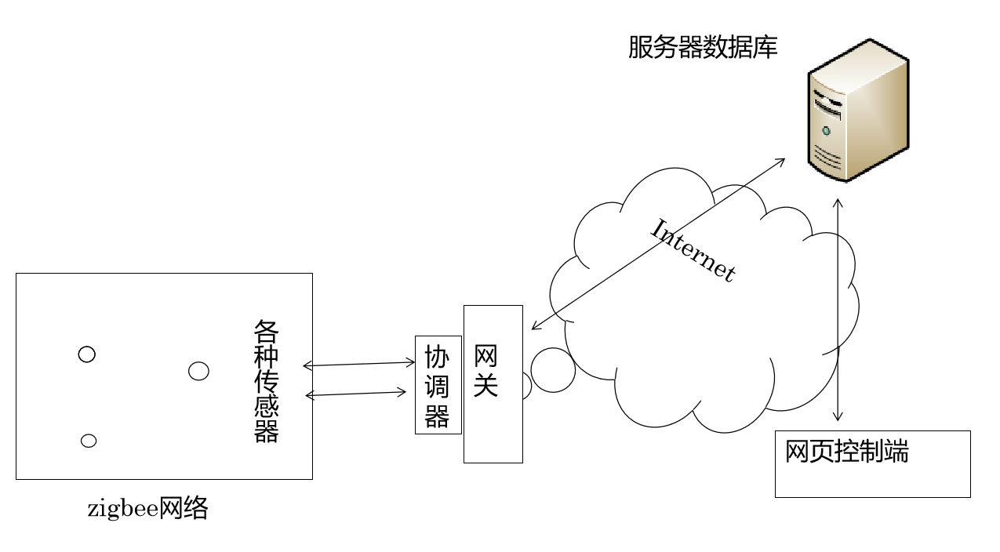
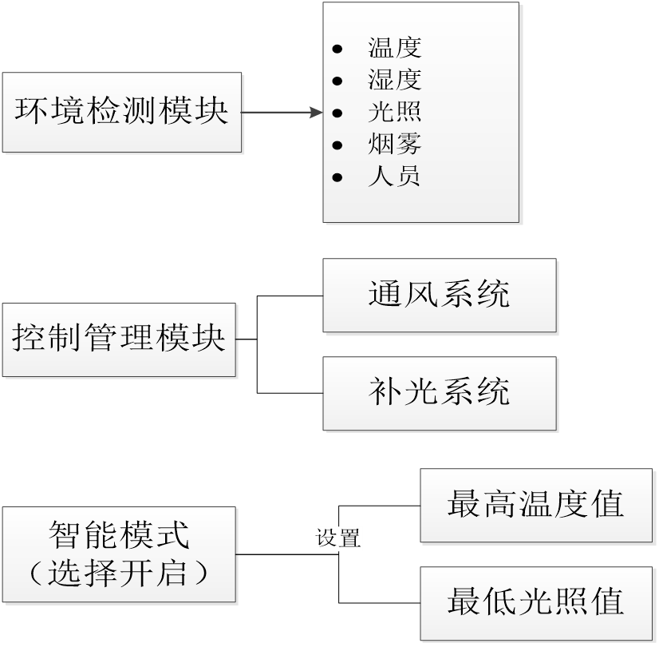
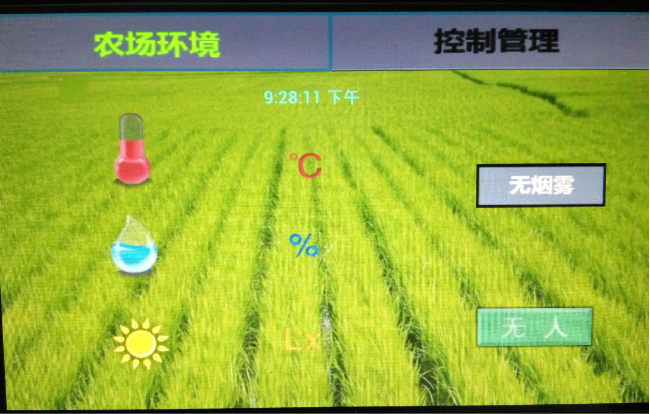
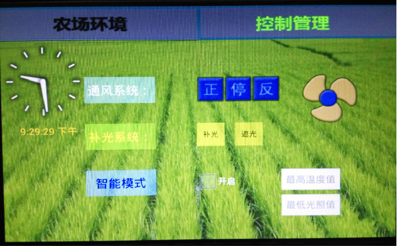
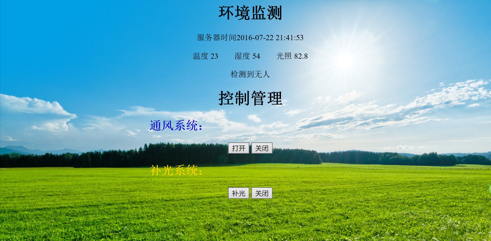

# 智能农场
物联网实训做一个智慧农场项目。  
可以参考我的博客：[物联网实训总结——简易的智能农场](https://blog.csdn.net/kevinbetterq/article/details/52027651)  
主要涉及： WSN感知数据、zigbee组网、PHP服务器、Android客户端 

## 主要任务
1、zigbee节点编程和配置  
2、多种传感器的使用，数据获取  
3、传感器数据的传输（zigbee通信协议的熟悉）  
4、串口通信：只有用串口通信，才能将协调器的数据获取出来。  
5、socket通信 

## 开发环境
- 服务器开发：PHP
- 网关：Android 

## 代码目录：  
- `/Skzh/` ---- Android网关程序，实现串口通信，socket传输，网关控制  
- `/Server/`  
  `tcp.php` ---- PHP服务器，进行socket通信，与数据库存取  
  `test.php` ---- 网页控制端，但没有无闪烁刷新  
  `iot.html和iot.php` --- 改进的网页控制端，实现无闪烁刷新  

## 概览
* 系统模型

* 功能介绍

## 系统展示
- Android网关

- 网页界面

## Authors
qiwenkaikai@qq.com
